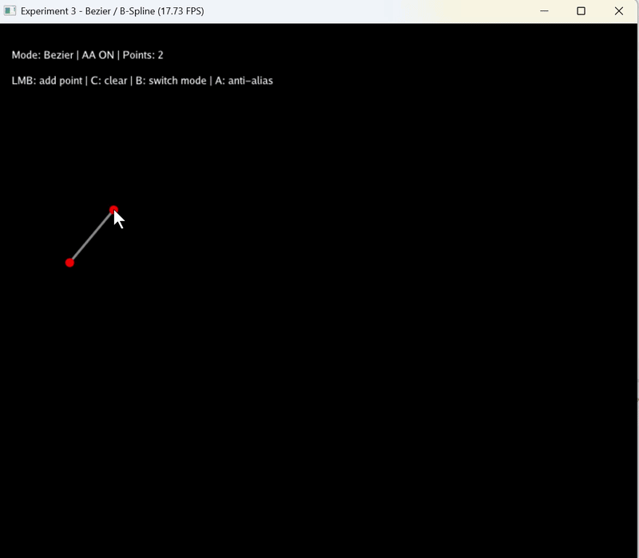
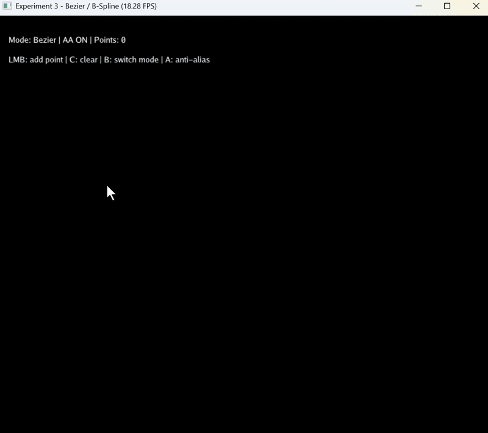
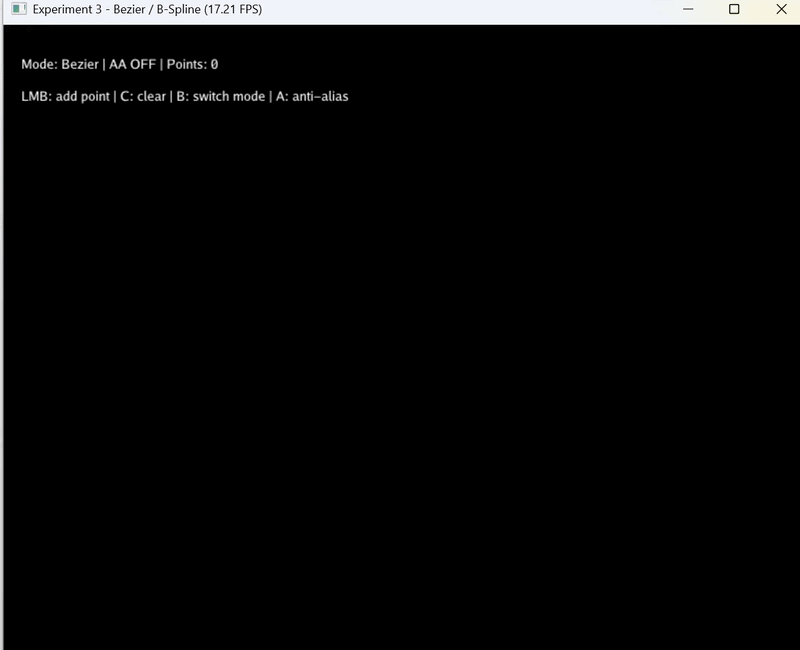

# 计算机图形学实验三：贝塞尔曲线

## 一、实验名称

贝塞尔曲线与 B 样条曲线交互式绘制实验

---

## 二、实验简介

本实验基于 **Python + Taichi** 实现了一个交互式曲线绘制程序。用户可以通过鼠标左键在窗口中添加控制点，程序会根据控制点实时计算并绘制对应曲线。

实验主要完成了以下内容：

- 贝塞尔曲线绘制
- De Casteljau 算法实现
- 基于 Frame Buffer 的像素级光栅化
- 鼠标点击与键盘事件交互
- 控制点与控制多边形绘制
- 曲线反走样绘制
- 均匀三次 B 样条曲线绘制
- 贝塞尔曲线与 B 样条曲线模式切换

程序使用 Taichi 提供的图形窗口接口进行交互显示，并使用 Taichi Field 与 Kernel 实现像素缓冲区、曲线采样点存储和曲线光栅化绘制。

---

## 三、实验目标

1. 理解贝塞尔曲线的几何意义。
2. 理解并实现 De Casteljau 递归线性插值算法。
3. 掌握光栅化的基础概念，即如何在像素缓冲区中直接操作和点亮像素。
4. 掌握 Taichi 中 Field、Kernel 与图形窗口交互的基本使用方法。
5. 理解 CPU 与 GPU 批量数据传输思想，避免逐点频繁写入 GPU Field。
6. 实现曲线反走样绘制，改善基础光栅化带来的锯齿问题。
7. 实现均匀三次 B 样条曲线，并观察其与贝塞尔曲线在几何控制特性上的差异。

---

## 四、项目结构

```text
CG-Lab3/
├── README.md
├── requirements.txt
├── .gitignore
├── assets/
│   ├── bezier.gif
│   ├── bspline.gif
│   ├── antialias.gif
└── src/
    └── main.py
```

文件说明：

| 文件或目录 | 说明 |
|---|---|
| `src/main.py` | 实验主程序 |
| `README.md` | 实验说明文档 |
| `requirements.txt` | Python 依赖列表 |
| `.gitignore` | Git 忽略规则 |
| `assets/bezier.gif` | 贝塞尔曲线运行截图 |
| `assets/bspline.gif` | B 样条曲线运行截图 |
| `assets/antialias.gif` | 反走样效果截图 |

---

## 五、运行环境

推荐运行环境：

- 操作系统：Windows 10 / Windows 11
- Python：3.10 或以上
- Taichi：1.7.4
- NumPy

安装依赖：

```bash
pip install -r requirements.txt
```

运行程序：

```bash
python src/main.py
```

如果当前设备 GPU 后端不可用，可以在代码中将：

```python
ti.init(arch=ti.gpu)
```

修改为：

```python
ti.init(arch=ti.cpu)
```

---

## 六、交互操作说明

| 操作 | 功能 |
|---|---|
| 鼠标左键 | 添加控制点 |
| C 键 | 清空全部控制点 |
| B 键 | 切换贝塞尔曲线 / B 样条曲线模式 |
| A 键 | 开启或关闭反走样 |
| ESC 键 | 退出程序 |

颜色说明：

| 颜色 | 含义 |
|---|---|
| 红色圆点 | 控制点 |
| 灰色折线 | 控制多边形 |
| 绿色曲线 | 贝塞尔曲线或 B 样条曲线 |

---

## 七、运行效果展示

> 本项目中的图片和演示文件均使用 PNG 或 GIF 格式。

### 1. 贝塞尔曲线绘制效果

贝塞尔曲线由所有控制点共同决定。随着控制点数量增加，曲线形状会受到所有控制点的整体影响。



---

### 2. 均匀三次 B 样条曲线绘制效果

B 样条曲线由局部分段曲线拼接而成。与贝塞尔曲线相比，B 样条曲线具有更明显的局部控制特性。



---

### 3. 反走样效果

开启反走样后，曲线边缘会更加平滑，可以减弱基础光栅化带来的锯齿感。



---


## 八、算法原理

### 1. 贝塞尔曲线

贝塞尔曲线是一类由控制点定义的参数曲线，其核心思想是通过参数化的线性插值将离散的控制点平滑连接。给定 $$n$$ 个控制点：

$$P_0, P_1, \dots, P_{n-1}$$

引入参数 $$t \in [0, 1]$$，曲线上任意一点可表示为控制点的加权组合。当 $$t$$ 从 0 连续变化到 1 时，曲线从起点 $$P_0$$ 平滑过渡到终点 $$P_{n-1}$$，中间形状受所有控制点共同影响。

---

### 2. De Casteljau 算法

为高效计算贝塞尔曲线上的点，本实验采用 De Casteljau 递归线性插值算法。该算法的直观理解是：在控制点构成的多边形上，反复对相邻点进行参数 $$t$$ 处的线性插值，直到仅剩一个点。

第一层插值（连接相邻控制点的线段上取点）：

$$P_i^{1} = (1 - t)P_i + tP_{i+1}$$

第二层继续对上一层插值结果进行同样操作：

$$P_i^{2} = (1 - t)P_i^{1} + tP_{i+1}^{1}$$

一般地，第 $$k$$ 层插值公式为：

$$P_i^{k} = (1 - t)P_i^{k-1} + tP_{i+1}^{k-1}$$

经过 $$n-1$$ 层插值后，最终只剩下一个点，该点即为贝塞尔曲线在参数 $$t$$ 处的坐标。

程序中的核心实现如下：

```python
def de_casteljau(points, t):
    temp = [np.array(p, dtype=np.float32) for p in points]

    while len(temp) > 1:
        next_points = []
        for i in range(len(temp) - 1):
            p = (1.0 - t) * temp[i] + t * temp[i + 1]
            next_points.append(p)
        temp = next_points

    return temp[0]
```

---

### 3. 光栅化与像素缓冲区

曲线计算完成后需要映射到屏幕显示，这一过程称为光栅化。屏幕可视为二维像素网格，本实验使用 Taichi Field 创建像素缓冲区：

```python
pixels = ti.Vector.field(3, dtype=ti.f32, shape=(WIDTH, HEIGHT))
```

缓冲区中每个像素存储 RGB 三通道颜色值。曲线计算得到的点坐标位于归一化范围 $$[0, 1] \times [0, 1]$$，需通过以下公式映射到屏幕像素坐标：

$$x_{pixel} = int(x \times WIDTH)$$

$$y_{pixel} = int(y \times HEIGHT)$$

映射完成后，在对应位置写入曲线颜色：

```python
pixels[x_pixel, y_pixel] = ti.Vector([0.0, 1.0, 0.0])
```

---

### 4. CPU 与 GPU 批处理思想

在交互式绘制场景中，性能优化至关重要。若在 Python 循环中逐点修改 Taichi Field，会产生频繁的 CPU-GPU 数据传输，导致帧率下降。为此，本实验采用批处理策略：

1. 在 CPU 端使用 NumPy 一次性计算全部曲线采样点；
2. 通过 `from_numpy()` 将数据批量传入 Taichi Field；
3. 在 Taichi Kernel 中并行遍历并绘制所有曲线点。

核心流程如下：

```python
curve_np, valid_curve_count = generate_bezier_curve_points(control_points)
curve_points_field.from_numpy(curve_np)
draw_curve_antialias_kernel(valid_curve_count)
```

该方式将多次小数据传输合并为单次大数据传输，显著降低了通信开销，确保交互绘制的流畅性。

---

## 九、选做内容实现

### 1. 反走样曲线绘制

**问题分析**：基础光栅化直接将曲线浮点坐标取整为像素坐标，仅点亮单个像素，导致曲线边缘呈现阶梯状锯齿。

**解决方法**：本实验实现了基于 $$3 \times 3$$ 邻域距离衰减的反走样算法。对于曲线点在像素空间中的浮点坐标 $$P = (x_f, y_f)$$，遍历其周围 9 个像素，计算每个像素中心 $$C = (x_c, y_c)$$ 到曲线点的欧氏距离：

$$d = \sqrt{(x_f - x_c)^2 + (y_f - y_c)^2}$$

根据距离计算透明度权重：

$$\alpha = \max(0, 1 - d / 1.5)$$

距离曲线点越近的像素获得越高的透明度权重，最终通过颜色混合公式实现平滑过渡：

$$Color_{new} = Color_{old}(1 - \alpha) + Color_{curve}\alpha$$

**效果**：曲线边缘从尖锐的阶梯状变为平滑的渐变过渡，视觉质量显著提升。

---

### 2. 均匀三次 B 样条曲线

贝塞尔曲线具有全局控制特性，任意控制点的变动会影响整条曲线形状，且曲线阶数随控制点数量增加而升高，不利于复杂曲线的局部调整。B 样条曲线通过分段多项式解决了这一问题。

本实验实现均匀三次 B 样条曲线，每 4 个相邻控制点生成一段三次曲线。设局部参数 $$u \in [0, 1]$$，对于控制点 $$P_0, P_1, P_2, P_3$$，曲线公式为：

$$P(u) = \frac{1}{6}[(-u^3 + 3u^2 - 3u + 1)P_0 + (3u^3 - 6u^2 + 4)P_1 + (-3u^3 + 3u^2 + 3u + 1)P_2 + u^3P_3]$$

当控制点数量为 $$n$$（$$n \ge 4$$）时，共生成 $$n - 3$$ 段三次 B 样条曲线。

#### 贝塞尔曲线与 B 样条曲线对比

| 特性 | 贝塞尔曲线 | B 样条曲线 |
|---|---|---|
| 控制方式 | 全局控制，任意控制点影响整条曲线 | 局部控制，控制点仅影响相邻几段曲线 |
| 曲线阶数 | 随控制点数量变化（$$n-1$$ 阶） | 固定为三次（3 阶） |
| 曲线类型 | 单一整条曲线 | 分段曲线拼接 |
| 端点特性 | 严格经过首尾控制点 | 不一定经过控制点 |
| 适用场景 | 控制点较少的简单曲线 | 控制点较多的复杂曲线 |

程序中按下 `B` 键可在两种曲线模式间切换，便于直观对比两者在几何控制特性上的差异。

---

## 十、核心代码说明

### 1. 像素缓冲区

```python
pixels = ti.Vector.field(3, dtype=ti.f32, shape=(WIDTH, HEIGHT))
```

该 Field 用于存储最终显示画面，每个元素表示一个像素的 RGB 颜色。

---

### 2. 曲线点缓冲区

```python
curve_points_field = ti.Vector.field(2, dtype=ti.f32, shape=MAX_CURVE_POINTS)
```

该 Field 用于存储 CPU 批量计算得到的曲线采样点。

---

### 3. 清屏 Kernel

```python
@ti.kernel
def clear_pixels():
    for i, j in pixels:
        pixels[i, j] = ti.Vector([0.0, 0.0, 0.0])
```

每一帧绘制前先清空像素缓冲区，避免上一帧图像残留。

---

### 4. 普通光栅化 Kernel

```python
@ti.kernel
def draw_curve_kernel(n: ti.i32):
    for i in range(n):
        pt = curve_points_field[i]

        x_pixel = ti.cast(pt[0] * WIDTH, ti.i32)
        y_pixel = ti.cast(pt[1] * HEIGHT, ti.i32)

        if 0 <= x_pixel < WIDTH and 0 <= y_pixel < HEIGHT:
            pixels[x_pixel, y_pixel] = ti.Vector([0.0, 1.0, 0.0])
```

该 Kernel 将曲线采样点映射到像素坐标，并点亮对应像素。

---

### 5. 反走样 Kernel

```python
@ti.kernel
def draw_curve_antialias_kernel(n: ti.i32):
    for i in range(n):
        pt = curve_points_field[i]

        fx = pt[0] * WIDTH
        fy = pt[1] * HEIGHT

        base_x = ti.cast(fx, ti.i32)
        base_y = ti.cast(fy, ti.i32)

        curve_color = ti.Vector([0.0, 1.0, 0.0])

        for dx in ti.static(range(-1, 2)):
            for dy in ti.static(range(-1, 2)):
                x = base_x + dx
                y = base_y + dy

                cx = ti.cast(x, ti.f32) + 0.5
                cy = ti.cast(y, ti.f32) + 0.5

                dist = ti.sqrt((fx - cx) * (fx - cx) + (fy - cy) * (fy - cy))
                alpha = ti.max(0.0, 1.0 - dist / 1.5)
                alpha = ti.min(alpha, 1.0)

                blend_pixel_safe(x, y, curve_color, alpha)
```

该 Kernel 对曲线点周围像素进行距离加权混合，使曲线显示更加平滑。

---

## 十一、实验结果分析

通过实验可以观察到以下现象：

1. 控制点数量为 2 时，贝塞尔曲线退化为一条直线。
2. 控制点数量为 3 时，贝塞尔曲线为二次曲线。
3. 控制点数量继续增加后，贝塞尔曲线会受到所有控制点的共同影响。
4. 贝塞尔曲线具有全局控制特性，任意控制点变化都可能影响整条曲线。
5. B 样条曲线不会严格经过所有控制点，而是以平滑方式靠近控制点。
6. B 样条曲线具有局部控制特性，局部控制点主要影响曲线的一小段。
7. 开启反走样后，曲线边缘更加平滑，锯齿感减弱。

---

## 十二、运行环境说明

在部分 Windows 设备上，Taichi 的不同图形窗口接口对系统图形后端的要求不同。如果运行使用 `ti.ui.Window` 的 GGUI 版本时出现：

```text
RuntimeError: Vulkan must be available for GGUI
```

说明当前系统环境中的 Vulkan 图形后端不可用或未正确配置。

为保证程序在更多 Windows 环境下稳定运行，本项目主程序采用兼容性较好的 Taichi 图形窗口接口实现交互显示。曲线计算、像素缓冲区、Frame Buffer 光栅化以及 Taichi Kernel 绘制逻辑均保持不变。

如需使用 GGUI 版本，可在支持 Vulkan 的设备上将窗口部分替换为 `ti.ui.Window` 相关接口运行。

---

## 十三、实验总结

本实验完成了一个基于 Python 与 Taichi 的交互式曲线绘制程序。程序通过鼠标左键添加控制点，通过键盘完成清空、模式切换和反走样开关等操作。

在贝塞尔曲线部分，程序实现了 De Casteljau 算法，通过递归线性插值计算曲线采样点。在光栅化部分，程序使用 Taichi Field 构建像素缓冲区，并通过 Taichi Kernel 将曲线点映射到屏幕像素坐标，实现了像素级绘制。

在性能优化方面，程序采用 CPU 端批量计算曲线采样点，再一次性传输到 Taichi Field 的方式，避免了在 Python 循环中逐点访问 GPU Field 导致的频繁通信问题。

在选做部分，程序实现了基于局部邻域距离衰减的反走样算法，使曲线边缘更加平滑；同时实现了均匀三次 B 样条曲线，并支持与贝塞尔曲线进行模式切换。通过对比可以发现，贝塞尔曲线更体现全局控制特性，而 B 样条曲线更适合控制点较多时的局部曲线建模。

通过本实验，我进一步理解了参数曲线、De Casteljau 算法、Frame Buffer、光栅化、反走样以及 B 样条曲线的基本原理和实现方法。
